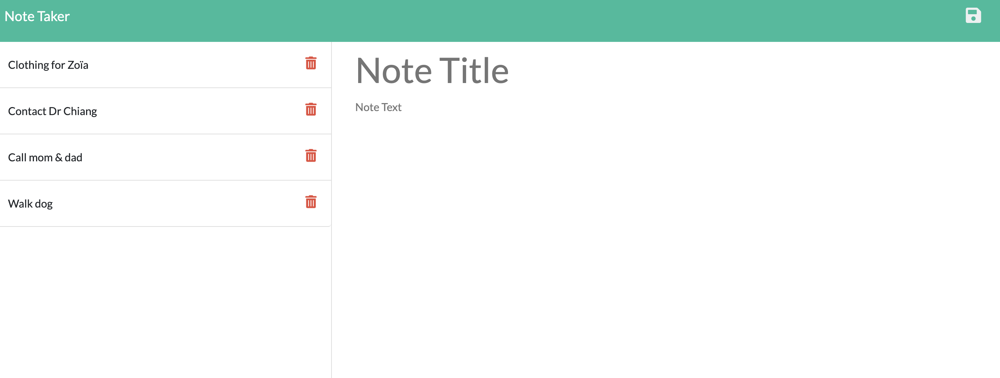

# Project Name - Note Taker in Express.js

## Table of contents

- [Overview](#overview)
  - [The challenge](#the-challenge)
  - [User Story](#user-story)
  - [Acceptance Criteria](#acceptance-criteria)
  - [Screenshot](#screenshot)
- [My process](#my-process)
  - [Built with](#built-with)
  - [What I learned](#what-i-learned)
- [Author](#author)
- [Acknowledgments](#acknowledgments)


## Overview

### The challenge

Note Taker in Express.js is an application that can be used to write and save notes. This application uses an Express.js back end and saves and retrieve note data from a JSON file.

### User Story

```md
AS A small business owner
I WANT to be able to write and save notes
SO THAT I can organize my thoughts and keep track of tasks I need to complete
```
### Acceptance Criteria

```md
GIVEN a note-taking application
WHEN I open the Note Taker
THEN I am presented with a landing page with a link to a notes page
WHEN I click on the link to the notes page
THEN I am presented with a page with existing notes listed in the left-hand column, plus empty fields to enter a new note title and the note’s text in the right-hand column
WHEN I enter a new note title and the note’s text
THEN a Save icon appears in the navigation at the top of the page
WHEN I click on the Save icon
THEN the new note I have entered is saved and appears in the left-hand column with the other existing notes
WHEN I click on an existing note in the list in the left-hand column
THEN that note appears in the right-hand column
WHEN I click on the Write icon in the navigation at the top of the page
THEN I am presented with empty fields to enter a new note title and the note’s text in the right-hand column
```
### Screenshot




### Links

- Solution URL: [GitHub repo](https://github.com/NaNifer/Note-Taker-in-Express.js)
- Live Site URL: [Heroku live site link](https://todos-in-express.herokuapp.com/)

## My process

### Built with

- Express.js
- uuid
- Heroku


### What I learned

What really got me hung up on this project was the serving of the static files in express.js. It took me a while to finally figure out what the issue was, but when serving the file, I did not need the /public at the beginning of the file location, because the mount path was already declared in the static directory. 

## Author

- GitHub - [NaNifer](https://github.com/NaNifer)
- Portfolio - [Nifer Kilakila](https://nanifer.github.io/Nifer-Kilakila-Portfolio-h2/)

## Acknowledgments

Thanks to the TA's, and several tutors that I referred to during this project. It took me a while to complete, but I couldn't have done it without you. Thanks for the learning opportunities!